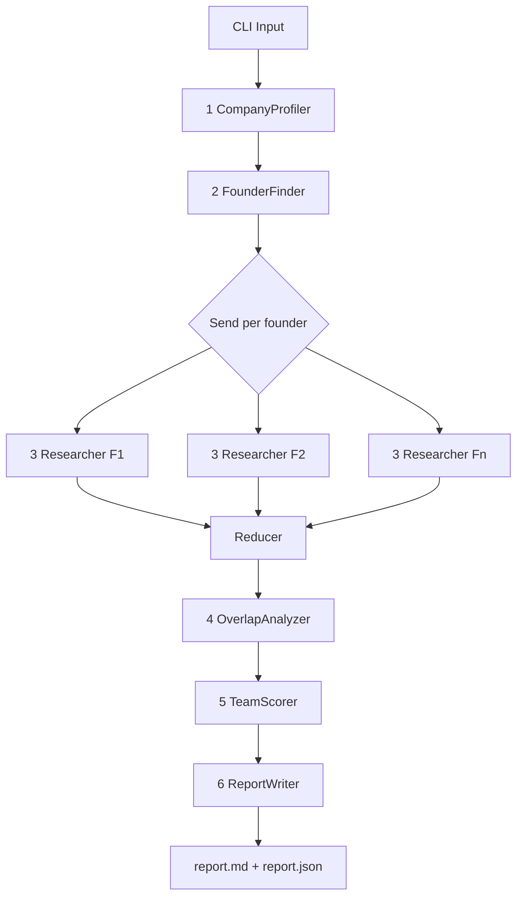

## Founding Team Analyzer — Detailed Multi-Agent Spec

A LangGraph-orchestrated tool. You pass a company input (URL, LinkedIn URL, or company name). The graph runs six specialized agents that resolve the company, find the founders, research each founder in parallel, detect shared history between them, score the team against a rubric, and emit a markdown + JSON report.

Project root: `/Users/henryhu1607/Documents/Professional_Development/vc_toolbox/founding_team_analyzer/`

---

### 1. Assumptions

These are the explicit assumptions baked into the design. If any are wrong, the design changes.

| # | Assumption | Implication |
|---|------------|-------------|
| A1 | You have OpenAI + Tavily API keys (no paid LinkedIn API) | Public LinkedIn data is only used via Tavily search snippets and any public bio pages we can fetch; no scraping behind auth |
| A2 | Targets are early-stage startups (pre-seed → Series A) | Founders are typically findable on the public web; rubric weights "founder-market fit" and "prior shared history" highly because team is the main signal at this stage |
| A3 | Most companies have 1–4 founders | Researcher fan-out caps at 5; >5 triggers a warning |
| A4 | Python 3.11+ available, single-user CLI | No web server, no auth, in-process LangGraph |
| A5 | LLM extraction tolerates noise | We always require the LLM to attach evidence quotes + source URLs to every claim; un-evidenced claims are dropped |
| A6 | Reasonable per-run budget: ~30–60 LLM calls and ~20–40 Tavily searches per company | Cost ≈ a few cents to ~$0.30 per company. We add per-node caps and a global circuit breaker |
| A7 | English-language sources only for v1 | Non-English founder bios are flagged but not deeply researched |
| A8 | Network failures must not crash the run | All HTTP calls go through `tenacity` retry + timeout; missing data degrades the score, never halts the graph |

---

### 2. Architecture



Each agent is a LangGraph node (a function `(state) -> partial_state`). The fan-out at step 3 uses LangGraph's `Send` API so researchers run concurrently. The reducer is LangGraph's `Annotated[list, operator.add]` on the `profiles` field.

#### Tech stack (locked-in defaults; no further options offered)

| Concern | Choice | Why |
|---|---|---|
| Orchestration | **LangGraph** (`langgraph >= 0.2`) | You already use it in `LangGraph_Deep_Research_from_Scratch`; supports Send fan-out, typed state, checkpointing |
| LLM client | **`langchain-openai` ChatOpenAI** | Plays cleanly with LangGraph; structured-output via `.with_structured_output(PydanticModel)` |
| Models | `gpt-4o` for reasoning nodes (Profiler, Researcher synth, Overlap, Scorer); `gpt-4o-mini` for extraction-only steps (Founder list parse, page summarization) | Cost vs. quality split |
| Web search | **Tavily** (`tavily-python`) — `search()` for queries, `extract()` for full-page text | Single dependency; built for agent use; built-in answer + raw_content |
| HTTP fallback | `httpx` + `trafilatura` | When we have a specific URL we'd rather parse ourselves than re-query Tavily |
| Retries / timeouts | `tenacity` (3 retries, exponential backoff), `httpx` 15 s timeout | A2 above |
| Validation | **Pydantic v2** | Schemas reused as LLM structured-output targets |
| CLI | **Typer** + **Rich** | Pretty terminal output + clean argparse |
| Config | `python-dotenv` reading `.env` | Standard |
| Logging | `structlog` JSON logs to stderr; pretty mode for TTY | Debuggable runs |
| Testing | `pytest` + `pytest-asyncio` + recorded VCR cassettes for Tavily | Deterministic CI |

#### State object

```python
class AnalyzerState(TypedDict, total=False):
    raw_input: str                              # what user typed
    company: Company | None                     # filled by node 1
    founders: list[Founder]                     # filled by node 2 (name + title + maybe url)
    profiles: Annotated[list[FounderProfile], operator.add]  # node 3 (fan-in)
    overlaps: TeamOverlap | None                # node 4
    score: TeamScore | None                     # node 5
    report_md: str | None                       # node 6
    warnings: Annotated[list[str], operator.add]
    cost: Annotated[CostLedger, merge_cost]     # tokens + search counts
```

---

### 3. Agents — exact responsibilities, inputs, outputs, prompts

For each agent below: **input from state**, **what it does (step by step)**, **model + prompt sketch**, **output it writes to state**, **failure mode**.

#### Agent 1 — CompanyProfiler

- **Input:** `state.raw_input` (string)
- **Job:** Resolve the input to a canonical `Company` object.
- **Steps:**
  1. Detect input type with regex: URL vs. LinkedIn URL (`linkedin.com/company/...`) vs. free-text name.
  2. If URL: `tavily.extract(url)` to grab homepage text + meta. If LinkedIn company URL: Tavily search `"site:linkedin.com/company <slug>"`. If free-text: Tavily search `"<name> startup official website"`.
  3. Call `gpt-4o` with the gathered context, structured-output → `Company(name, website, linkedin_url, one_liner, sector, sub_sector, hq_location, founded_year, stage_signals[], source_urls[])`.
  4. Validate: name + website required; if missing, emit `warning` and continue with partial data.
- **Prompt sketch:** "Extract company facts. Only state things present in the sources. For every field include the source URL it came from. If unknown, return null."
- **Output:** `state.company`
- **Failure mode:** If even `name` can't be resolved, stop the graph with a clear error.

#### Agent 2 — FounderFinder

- **Input:** `state.company`
- **Job:** Produce a list of `Founder` candidates.
- **Steps:**
  1. Run 4 parallel Tavily searches:
     - `"<company> founders"`
     - `"<company> co-founder CEO"`
     - `"<company> site:crunchbase.com"`
     - `"<company> founding team"`
  2. Also `tavily.extract` the company website's `/about` and `/team` pages if discoverable (try `<website>/about`, `<website>/team`, `<website>/company`).
  3. Pass the deduped search snippets + extracted page text to `gpt-4o-mini` with structured output → `list[Founder]` where `Founder = {name, title, linkedin_url?, twitter_url?, source_urls[]}`.
  4. Deduplicate by normalized name; cap at 5; emit warning if >5 candidates.
  5. Confidence filter: drop any founder where `title` doesn't contain founder/co-founder/CEO/CTO/CPO/COO, unless the snippet explicitly calls them a "founding member".
- **Prompt sketch:** "From these search snippets and pages, list ONLY people explicitly described as founders or co-founders of <company>. For each, give name, title, LinkedIn URL if mentioned, and the source URL."
- **Output:** `state.founders`
- **Failure mode:** Zero founders found → write a warning and proceed to ReportWriter with a partial "could not identify founders" report.

#### Agent 3 — FounderResearcher (fan-out, one instance per founder)

- **Input:** A single `Founder` (dispatched via `Send`)
- **Job:** Build a deep `FounderProfile`.
- **Steps (per founder):**
  1. Run a fixed search plan (5 Tavily queries, capped):
     - `"<full name> <company>"`
     - `"<full name> LinkedIn"`
     - `"<full name> education"` (or `"<full name> alma mater"`)
     - `"<full name> previous startup"` (or `"<full name> founder"`)
     - `"<full name> interview"` (often yields rich bio content)
  2. Tavily extract the top 3 highest-authority URLs (Crunchbase, LinkedIn public profile snippet, personal site, company "about" page, press articles).
  3. Two-stage LLM extraction:
     - **Stage A (mini):** For each source separately, extract raw facts into `RawFactBundle(education_hits, work_hits, startup_hits, achievement_hits)` with each fact carrying a `source_url` and the verbatim quote.
     - **Stage B (4o):** Merge all `RawFactBundle`s into a single, deduplicated, time-ordered `FounderProfile`. Resolve conflicts ("Stanford 2010 vs Stanford 2011") by preferring the more authoritative source (LinkedIn > Crunchbase > company site > press).
  4. Mark any unverifiable claim with `confidence: low`.
- **`FounderProfile` schema:**
  ```python
  class Education(BaseModel):
      school: str; degree: str | None; field: str | None
      start_year: int | None; end_year: int | None
      source_urls: list[str]
  class WorkExperience(BaseModel):
      company: str; role: str
      start_year: int | None; end_year: int | None  # None = current
      is_founder_role: bool; is_technical_role: bool
      source_urls: list[str]
  class PriorStartup(BaseModel):
      name: str; role: str; outcome: Literal["exit","shutdown","ongoing","unknown"]
      year_started: int | None; source_urls: list[str]
  class FounderProfile(BaseModel):
      name: str; current_title: str
      linkedin_url: str | None
      education: list[Education]
      work: list[WorkExperience]
      prior_startups: list[PriorStartup]
      accelerators: list[str]   # e.g. "YC W21"
      notable_achievements: list[str]
      total_years_experience: int | None
      domain_years_experience: int | None  # years in the startup's sector
      confidence: Literal["high","medium","low"]
      missing_fields: list[str]
  ```
- **Prompt rules:** "Never invent. If you cannot find a fact in the supplied text, leave it null. Every claim must cite at least one source_url from the provided list."
- **Output:** Appends one `FounderProfile` to `state.profiles`.
- **Failure mode:** If zero sources found for a founder, return a near-empty `FounderProfile` with `confidence=low` and `missing_fields` populated.

#### Agent 4 — OverlapAnalyzer

- **Input:** `state.profiles` (full list)
- **Job:** Compute structured overlaps between every pair of founders.
- **Steps (deterministic Python first, then LLM polish):**
  1. **Education overlap:** for each pair, find schools in common; if both have years, check whether the year ranges intersect.
  2. **Work overlap:** same logic on `work[]` — same company name normalized + intersecting year ranges. Flag whether they were in the same `is_technical_role` cluster.
  3. **Prior-startup overlap:** any shared `PriorStartup.name`.
  4. **Accelerator overlap:** any shared accelerator cohort.
  5. **Geographic overlap:** same `hq_location` across companies in same year band (weak signal).
  6. **LLM pass (gpt-4o):** given the deterministic overlaps + raw quotes, produce a short narrative for each overlap ("Co-founded Foo in 2018, then both joined Meta 2020–2023") and rate each as `strong | medium | weak`.
- **`TeamOverlap` schema:**
  ```python
  class FounderPairOverlap(BaseModel):
      founder_a: str; founder_b: str
      shared_schools: list[SharedSchool]
      shared_employers: list[SharedEmployer]
      shared_prior_startups: list[str]
      shared_accelerators: list[str]
      narrative: str
      strength: Literal["strong","medium","weak","none"]
  class TeamOverlap(BaseModel):
      pairs: list[FounderPairOverlap]
      overall_strength: Literal["strong","medium","weak","none"]
  ```
- **Output:** `state.overlaps`
- **Failure mode:** Single-founder team → write `overall_strength="none"` with note "solo founder" (TeamScorer will dock the team-completeness criterion accordingly).

#### Agent 5 — TeamScorer

- **Input:** `state.company`, `state.profiles`, `state.overlaps`
- **Job:** Apply the rubric (Section 4 below). Output a per-criterion score + evidence + overall weighted score + tier.
- **Steps:**
  1. Build a single condensed context dossier (~2–4k tokens) from company, profiles, overlaps.
  2. Call `gpt-4o` with structured output `TeamScore` (schema below). The prompt enumerates the 8 criteria verbatim, asks for: integer 0–5, 1–3 evidence bullets (each citing a source URL from the dossier), and a one-line rationale.
  3. Compute the weighted overall (0–100) in Python (not in the LLM) to avoid arithmetic mistakes.
  4. Map overall → tier: `>=80 Strong`, `60–79 Promising`, `40–59 Mixed`, `<40 Weak`.
  5. Self-critique pass (`gpt-4o`): "Re-read the dossier. Are any scores not supported by evidence? List adjustments." Apply adjustments only if they cite contradicting evidence. (This adds one LLM call but materially improves calibration.)
- **`TeamScore` schema:**
  ```python
  class CriterionScore(BaseModel):
      key: str                      # e.g. "founder_market_fit"
      label: str
      weight: float                 # from rubric
      score: int                    # 0..5
      evidence: list[str]           # each must contain a source URL
      rationale: str
  class TeamScore(BaseModel):
      criteria: list[CriterionScore]
      overall_0_100: float
      tier: Literal["Strong","Promising","Mixed","Weak"]
      top_strengths: list[str]
      top_risks: list[str]
      open_questions: list[str]     # things a VC should ask in DD
  ```
- **Output:** `state.score`
- **Failure mode:** If profiles are too thin (>=2 founders with `confidence=low`), the scorer caps `overall_0_100` at 60 and adds a `top_risks` item: "Limited public information; conclusions are tentative."

#### Agent 6 — ReportWriter

- **Input:** Everything in state.
- **Job:** Render the final markdown.
- **Steps (no LLM call — pure template):**
  1. Render header (company name, sector, one-liner, sources).
  2. Render founder cards: name, title, education timeline, work timeline, prior startups, notable items, confidence badge.
  3. Render the overlap matrix (a Markdown table — pairwise strength) + narrative bullets.
  4. Render the scoring table (criterion / weight / score / rationale) + overall score + tier badge.
  5. Render `top_strengths`, `top_risks`, `open_questions`.
  6. Render appendix: all source URLs grouped by founder.
  7. Save to `out/<company-slug>/report.md` and `report.json`. Also print to stdout via Rich.
- **Output:** `state.report_md` and files on disk.
- **Failure mode:** Always succeeds; if anything is missing it prints "N/A — no public data found".

---

### 4. Founding-team scoring rubric (the criteria you asked about)

Each criterion is scored 0–5. Anchors are explicit so the LLM scores consistently.

| # | Criterion key | Weight | Score 0 anchor | Score 3 anchor | Score 5 anchor | Required evidence |
|---|---|---|---|---|---|---|
| 1 | `founder_market_fit` | 20% | No founder has worked in this sector | One founder has 2–4 yrs in sector | Multiple founders have 5+ yrs in the exact sub-sector OR built/operated the problem they're solving | Job titles + dates + sector match |
| 2 | `skill_complementarity` | 15% | All founders share the same skill (e.g. all engineers, no commercial) | Two of {tech, product, business} covered | All three covered with senior-level depth; explicit CEO/CTO split | Role mix across `work[]` |
| 3 | `prior_shared_history` | 15% | No shared school or employer | Shared school OR employer with overlapping years | Co-founded a prior company together OR overlapped 2+ yrs at same employer in same team | From `TeamOverlap` |
| 4 | `founder_experience` | 15% | No founder has started anything | One founder with one prior startup (any outcome) | Multiple founders with prior startups, ≥1 successful exit OR scaled to material revenue | `prior_startups[]` |
| 5 | `pedigree` | 10% | No notable school/employer | One founder from top school OR top employer | Multiple founders from top-tier schools AND top-tier employers (FAANG/top-tier-AI-labs/unicorn ops roles) | `education[]` + `work[]` |
| 6 | `seniority_depth` | 10% | <3 yrs avg experience | 5–8 yrs avg, some leadership | 10+ yrs avg, multiple founders held VP/Director or were technical leads | `total_years_experience` |
| 7 | `network_signals` | 10% | None | One founder has YC/Techstars OR strong public following | Multiple accelerator alumni or repeat-founder networks; known investor backing visible | `accelerators[]` + press |
| 8 | `team_completeness` | 5% | Solo founder with critical gap | 2 founders, one gap acknowledged | 2–3 founders, complementary, no critical gap | Inferred from above |

**Weighted overall** = `sum(weight_i * (score_i / 5)) * 100` → 0–100.

Tier mapping:
- 80–100 **Strong** — would push to first meeting
- 60–79 **Promising** — needs targeted diligence
- 40–59 **Mixed** — major gaps; pass unless thesis-fit
- 0–39 **Weak** — pass

The report also surfaces qualitative outputs from the scorer: `top_strengths`, `top_risks`, `open_questions` (DD questions). This is what makes the tool actually useful beyond a number.

---

### 5. File layout

```
vc_toolbox/founding_team_analyzer/
├── pyproject.toml
├── requirements.txt
├── .env.example
├── README.md
├── src/founding_team_analyzer/
│   ├── __init__.py
│   ├── cli.py                      # typer entrypoint
│   ├── config.py                   # env + model names + caps
│   ├── graph.py                    # LangGraph wiring + Send fan-out
│   ├── state.py                    # AnalyzerState TypedDict
│   ├── schemas.py                  # Company, Founder, FounderProfile, TeamOverlap, TeamScore
│   ├── scoring.py                  # rubric weights + tier mapping + Python-side overall calc
│   ├── prompts/
│   │   ├── company_profiler.md
│   │   ├── founder_finder.md
│   │   ├── founder_extract_stage_a.md
│   │   ├── founder_extract_stage_b.md
│   │   ├── overlap_narrative.md
│   │   ├── team_scorer.md
│   │   └── team_scorer_self_critique.md
│   ├── tools/
│   │   ├── search.py               # Tavily wrapper with retry + caching
│   │   ├── fetch.py                # httpx + trafilatura
│   │   └── normalize.py            # name/school/company normalization
│   └── nodes/
│       ├── company_profiler.py
│       ├── founder_finder.py
│       ├── founder_researcher.py
│       ├── overlap_analyzer.py
│       ├── team_scorer.py
│       └── report_writer.py
├── tests/
│   ├── test_schemas.py
│   ├── test_scoring.py             # rubric math
│   ├── test_normalize.py
│   └── fixtures/                   # canned LLM + Tavily responses
└── examples/
    └── sample_report.md            # one full end-to-end output
```

---

### 6. CLI

```
# Primary command
python -m founding_team_analyzer analyze "https://acme.ai"
python -m founding_team_analyzer analyze "Acme Robotics"
python -m founding_team_analyzer analyze "https://www.linkedin.com/company/acme-robotics" --out ./out/

# Useful flags
--max-founders 5
--model gpt-4o          # override
--no-self-critique      # skip the scorer self-critique pass
--verbose               # structlog pretty mode
--save-state ./debug.json   # dump full AnalyzerState for debugging
```

---

### 7. Cost + safety guardrails

- Per-run hard caps (read from `config.py`): max 8 Tavily searches per founder, max 4 page extracts per founder, max 20 LLM calls overall.
- A `CostLedger` accumulator in state tracks token + search counts; if a cap is hit, the affected node logs a warning and proceeds with what it has.
- All LLM calls go through one helper that: (a) injects "respond ONLY with valid JSON matching this schema"; (b) wraps in `with_structured_output(...)`; (c) retries once on validation failure.
- Robots.txt / ToS: we only use Tavily's API + fetch public HTML pages. No authenticated LinkedIn scraping.

---

### 8. What gets delivered (concrete checklist)

1. Full scaffold at `vc_toolbox/founding_team_analyzer/` matching Section 5.
2. All 6 agent nodes implemented and wired in `graph.py`.
3. Pydantic schemas (Section 3) with strict validation.
4. Tavily + httpx tool wrappers with retry + in-memory caching.
5. Rubric implementation in `scoring.py` with unit tests on the math.
6. Working CLI `python -m founding_team_analyzer analyze "<input>"`.
7. `.env.example`, `requirements.txt`, short `README.md` (run instructions + sample output).
8. One example run committed to `examples/sample_report.md` against a real public YC-stage startup so you can see exactly what the output looks like.

### 9. Explicitly out of scope (v1)

- Paid LinkedIn data (Proxycurl); the researcher tool interface is pluggable for later.
- Persistent cache / DB; runs are in-memory.
- Web UI.
- Investor / market / financials analysis.
- Non-English founders/sources (flagged but not deep-researched).
- Continuous monitoring; this is a one-shot CLI per company.
